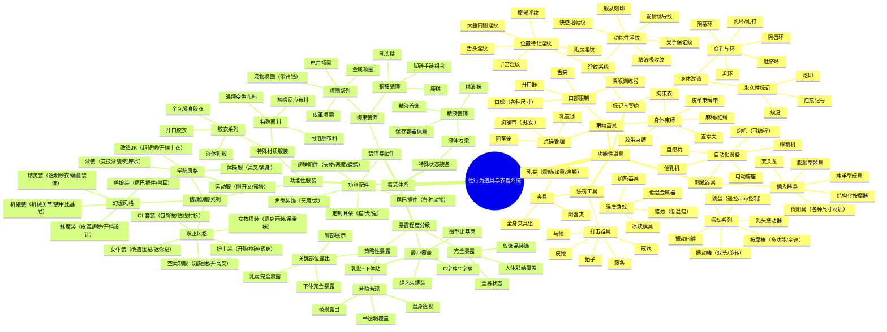

# 基础信息 · 母猪版

> **结构**照 `../../basic-info.md`。
>
> ★★ **本文分两层，缺一层都不成立**：
> **① 通用技法层**（照搬 `_素材库/2026.08.12/1.核心条目`）—— **所有文风都要用**；
> **② 本套自己的层**（`-母猪世界书.json` ＋ `-阶段性反差母猪世界书.json`）。
> ★ **一比一仿照或直接用**（换掉角色名与场景，骨架句式照原样）。

---

## 通用层 · 落笔层次与体量（照搬 🅱️2）

落笔层次与体量:
  一处媚肉落笔时形态与受力质地两层必须给全，再从下列任一项里取第三层，缺层不成立:
    这块肉此刻被压出、挤出、翻出来的东西，以及被挤到哪一侧去了
    温度、潮气、肌肤的质感与浮上来的骚味
    隔着衣料看过去这一处透出多少、被兜住多少、从边缘溢出多少
    手掌整个覆上去攥紧会挤出多少、掰开压住会露出什么
    这一处的动静牵着哪一处跟着晃、跟着陷、跟着张开
  层与层顺着上一层的结果往下接，不并列罗列。
  镜头落在一具骚躯上，切走之前至少详写一处、略写两处：详写的那处层次给全，略写的两处各给一笔可见变化。段落类型不影响本条，镜头不在她身上的段落不受此限。
  不许拿骚、熟、媚、肥这类标签充当一段描写的收尾。

---

## 通用层 · 观察方位（照搬 🅱️2）

观察方位:
  落笔前先确定视线方位、身体朝向与距离。看不见的一律不落笔。
  距离越近可写的东西越换质地：远处这具骚躯只剩比例与轮廓，最先撞进眼里的是那副安产型肥尻在窄腰底下横铺出去的宽度，以及走动时整片尻肉左右交替颤动的幅度；中距离看衣料勒陷与媚肉晃动；凑到贴脸的距离看的是汗珠沿着乳沟往下爬、绒毛在光里立起来、以及焖了一整天的骚气扑上来。
  同一个人连写数段时换方位也换焦点，整具骚躯按新角度重写一遍：这一段写领口勒进骚奶子陷出的那道压痕，下一段写走动时那团骚奶子甩出去又坠回来的行程，再下一段写掌心整个覆上去能从指缝里挤出多少。禁止连着复用同一部位的同一个角度与同一套句式，禁止插入与当前动作无关的部位特写。

---

## 通用层 · 体型落点（照搬 🅱️2）

体型落点:
  先认定这具身体在哪个维度上偏离寻常，再把那点偏离写成媚肉的具体表现。以下几档可同时命中逐条叠加，示范之外的身体照此自行取落点。
  丰腴写满和溢：骚奶子从领口溢出去堆在锁骨底下、骚尻肉把裙摆从底下鼓开撑出横褶、两片骚腿根嫩肉在并拢时挤得往两侧翻。
  纤细只管腰线以上，写窄和紧：骨架收紧线条利落，纤腰窄到一手能掐，一段皓颈往下锁骨勾出两道浅窝；腰线以下照旧顺着髂骨往外铺开落到肥尻。
  高挑写纵向拉开的距离：跨一步大腿从裙摆底下抽出长长一截，俯身时腰到肥尻的行程比旁人拉得更长，站直了胸前那两团肥奶子正悬在对视者眼前的高度。
  娇小写尺寸落差：站直了头顶只够到对方胸口，仰起脸说话时整片视野被那两团肥硕骚奶子占满；一副窄骨架撑着腰线底下横铺出去的安产型肥尻，两瓣肥尻肉在身后撅出的宽度比肩还阔。
  小奶写敏感和精致：胸前隆起的弧度刚好填满掌心，浅粉乳尖在布料下顶出两个小点碰一下就挺立充血，小巧弧面绷得紧致挺翘。平坦前胸把锁骨胸口线条衬得更清晰，贴身衣物直接压着乳尖每次呼吸都在上面蹭。
  禁止把紧实、松软、肥腻、纤薄这类互斥的词堆在同一处媚肉上。

---

## 通用层 · 质感与光（照搬 🅱️2）

质感与光:
  皮肉本身的润泽是常态，不需要来源。光落在这片皮肉上不聚成点，从最亮处一路匀到暗处过渡得又缓又长，绷紧的那片鼓起来的肉面浮出一整片匀净高光，薄处光整个透过去把耳廓、指节与腿根内侧那片嫩肉底下浮着的血色一并映出来。指腹划过去一路滑到底不带涩感，按下去的凹陷弹回来不留痕。刚出浴那阵热气把这层润泽整个蒸上来，皮肉透出粉，指腹按下去只有滑腻不带水。
  汗腻、水痕、体液这类附着在皮肉表面的湿亮必须有来源：雌汗、体温、紧身衣物、运动、拥挤空间或性刺激。禁止把常态润泽写成体表挂着液体让所有人无条件浑身流油，禁止连着堆油亮、水光、湿滑这类同义词。
  打光跟着场景取：侧光把一团骚奶子的下缘与整条臀线各勾出亮边，中间那截陷进阴影；逆光把薄衣料照得只剩一层轮廓连底下乳晕的深色都浮出来；汗湿的皮肉整片反出水光沿着受力的方向淌成一道；光暗下来只留胸、腰、臀三处起伏连成的剪影。
  质地分部位取，不用一个词概括全身。臀肉焖软饱满按下去要慢慢弹回，腰腹柔韧一按就回弹，大腿内侧比别处更潮热，脸颊脖颈的皮肉最薄嫩。
  乳沟、腿根与臀缝焖着体温、汗意和浓重气息。媚香落笔时换层次，由体温、洗浴用品、雌汗、衣物焖出的气味和裆间骚气叠成，禁止每次复用同一句发情雌臭。

---

## 通用层 · 取材时机（照搬 🅱️2）

取材时机:
  首次登场: 完整巡视整具骚躯，把她区别于旁人的那几处写足，不必按从头到脚的顺序。可由脚步、雌汗气、衣料摩擦、背影、衣物绷紧处或最具辨识度的部位先行，再补齐脸、胸腹、腰胯与腿足。隔了较长篇幅重新登场按首次登场处理。
  已经在场: 手、视线、衣物受力或动作落到哪里镜头便跟到哪里。被触碰和被牵动的部位优先，其余部位一两笔扫过。
  姿势变化: 重新描写被压平、拉长、绷紧、摊开、下坠或从新角度暴露的媚肉，禁止把站姿的乳臀状态直接搬进俯卧、侧躺和奔跑。
  多人场景: 正在被搭话或被碰到的那个详写，其余各给一处最认得出来的媚肉特征。不同雌性的身体特征禁止互串。
  路过角色: 一笔带过也染上色情底色，写步态、衣料轮廓、胸臀余颤或擦肩时飘过来的媚香，不展开完整巡视。
  局部特写: 由当前视线、衣物变化或实际动作自然引出，距离不构成限制，凑到乳沟、腿根与衣物内部的极近处照写。特写直接插进正在进行的事件与对白中间，事件的因果与人物位置照旧连续往下走。只交代姿势、位移与谁在说话的短句不算描写，她仰起脸、她伸手撑住这类标注句不顶替特写。

声音:
  肉体动态可带声音，声响由挨着的材质与力度决定。焖软的骚奶子骚尻肉挨一巴掌或整个人坐实下去时闷响偏钝，绷紧的媚肉回弹得更短促，丝袜面互相蹭过是细碎的窸窣，焖潮的腿肉离开座面时黏连着扯出轻响。
  声音跟着实际发生的挤压、摩擦、拍击与晃动出现，禁止把噗叽啪叽塞进每次走路和转身。

自行动作与生理信号:
  雄性走近半步、隔着裙料蹭到桌沿，这身不受她管束的媚肉与骚穴便自行有所微动，她知情与否不影响，也可以毫无来由地自行发作。
  落笔只给形变、位移与渗出来的东西，禁止写它想要什么、在讨好谁。
  体表可见的一档，日常场合与雄性同处一室时随手取用：呼吸变浅、鼻翼翕动、脸颊泛红、嫩唇湿润、腰腹轻颤。
  衣内与体内的一档，色情张力顶上来时取用：两瓣肥厚屄唇自行分开一线又合拢回去，乳粒隔着衣料自己涨硬挺起来；宫袋自己往下坠得快贴上屄口，宫口一开一合；一圈圈腔肉自行绞紧又松开；肛口那圈褶皱无端收紧了一下。
  同一种信号不连续复用，同段内只取一处写足。
  以上信号与动作一概不构成角色意愿的证据，客观叙事不据此判定她想要什么。射精后不自动写成受精、怀孕与永久性的身体改变。
</B2>

---

## 通用层 · 词从哪来（照搬 🅱️4 · 词料全表）

词料:
  雄性词料:
    鸡巴: 形态:驴屌/巨根/粗壮肉茎｜色态:紫黑肉屌/青筋暴起/狰狞暴跳｜畜化:配种鸡巴/灌精大屌/爆肏雌腔的驴屌｜脏污:积着陈年耻垢的臭屌/冠状沟糊满精膏的脏屌
    睾丸: 形态:肥大卵蛋/皱巴巴蛋皮裹着的沉坠肥卵｜功能:鼓胀翻涌的精囊/永远装满种汁的肥卵｜气味:沤了一整天的酸馊蛋皮/闷出汗腥的会阴/焖在裤裆里的汗酸/会阴的馊腻
    精液: 质感:腥臭浓精/粘稠挂壁的种汁/浓白种浆｜浓度:白浊/泛黄浓精｜功能:配种精浆/孕种浓浆｜状态:灌到满溢/咕叽咕叽往外涌/直冲孕袋深处｜残留:精垢/干在媚肉上的精渍/糊住耻毛的精膏

  雌性词料:
    妆与淫颜: 妆:浓艳妆容/眼尾扫开一片胭脂的媚妆/素净淡妆/只扫了层薄粉的清雅妆面/颊上两团粉扑扑的腮红/水润透亮的少女嫩妆｜淫颜:母畜淫颜/雌堕痴颜/翻着白眼吐出舌头的骚脸/随每记打桩变一次形的挨肏媚颜/笑意僵在眼角、嘴却合不拢的骚颜/被掰开下巴拽出舌头玩的痴相
    乳:
      主体: 骚奶子/臭奶子/大肥奶子/肥奶子/小骚奶子/吊钟骚奶/水滴形骚奶/紧致翘挺的骚小奶/淫乳/奶袋子/种母奶袋
      修饰: 奶肉/乳肉/乳丘/奶包/稚嫩奶包/青涩薄乳/被碾成肥腻乳饼/腻软/肥软/浑圆/沉坠
      乳尖乳晕: 骚奶头/涨硬骚奶头/粗挺乳粒/浅粉骚奶头/骚乳晕/宽大骚乳晕/整圈隆起的骚乳晕嫩肉/被嗦得发亮的乳粒
      坐标: 乳根/乳沟/锁骨窝
      禁: 乳房/胸部/前胸/上身（体面词顶替）
    腹: 状态:顶出鸡巴形状的腹壁/连冠状沟的棱都撑出来的腹皮/被灌到鼓起来的小腹｜残留:积了一汪浊白的肚脐
    屄穴: 形态:滚烫肥屄/屄洞/肥美耻丘｜功能:榨精骚屄/配种雌穴/媚穴｜状态:泥泞淫屄/蠕动收缩的肉穴/被撑成屌形的肉腔｜畜化:发情母畜的焖骚雌腔/贱穴/骚屄/烂屄｜物化:排精肉便屄穴/鸡巴套子屄洞
    阴唇阴蒂: 阴唇:肥厚阴唇/焖熟屄唇/肥嫩屄瓣/油润屄唇/外翻充血的嫩肉｜阴蒂:涨硬阴蒂/剥出来暴露在外的肉粒/被捻搓到充血的骚豆/挺出来蹭着布料的阴蒂
    子宫: 物化:储精罐/孕袋/精液便池/着床肉窝｜状态:被肏得直往下坠、快贴到屄口的宫袋/宫袋都要下垂了/凑下来亲龟头的宫口/被灌满撑到鼓胀的孕袋
    淫液: 质感:清亮骚水/浓黏淫液/腥甜屄水/拉出细丝的黏液｜状态:顺腿根往下爬的骚水/淌到丝袜袜口的淫液/喷出来的骚水/一股股泼出去的潮水｜残留:屄口挂着的白沫/浸透丝面的一片湿痕
    口舌喉: 物化:喉穴/擦屌肉套/深喉肉腔/口便器/鸡巴套子嘴｜状态:噘紧的嫩唇裹住屌身往前抻长整张脸跟着送出去的马脸/两颊深陷成坑把整根屌身吸住/含不住往外淌的涎水/被撑成O型的嘴｜唇舌:裹住屌身的红艳唇瓣/铺开裹住的软舌/钻进缝隙的灵活舌尖/吐出来接精的舌面｜残留:沾着鸡巴毛的唇角/沾着精斑的唇角
    臀: 形态:翘臀/肥尻/蜜桃巨臀｜质感:腴软肥尻/焖熟桃尻/噗叽噗叽的雌熟油尻｜部段:深邃臀缝/焖出潮气的臀沟/臀腿折痕｜畜化:安产型肥尻/撅着等肏的淫臀
    腿: 形态:美腿/纤细骚腿/丰润长腿｜质感:油润腿肉/泛着水光的腿根嫩肉｜部段:腿根素股小三角/两道深陷的腹股沟线/绷到泛白的沟底嫩肉
    足: 形态:淫足/丝足｜质感:焖热脚趾/潮润足心/被丝袜裹出丝光的嫩脚
    肉体整体: 肉感:媚肉/淫肉/雌肉/焖熟媚肉/油润雌肉/白腻贱肉｜肌肤质感:白腻/白到透粉/吹弹可破/半透出底下血色的薄嫩皮肉/泛着暖光的润白肌肤/泛着水光的嫩肤/汗浸出油亮的肌肤｜整具骚躯:骚躯/淫躯/雌躯/肉躯/媚躯/骚软身体/焖熟淫躯/白腻肉躯/淌满腻汗的骚躯/通身欠肏的贱肉｜畜化:发情雌肉/配种淫肉/焖熟母畜媚肉/种母骚躯

  雌性贬低/自贬称呼:
    行为词根: 送屄/倒贴/撅尻/迎屄/嗦屌/含屌/掰屄/张屄/求肏/求种/榨精/绞精/馋屌/痴屌
</B4>

---

# ② 本套自己的层

## 女性描写风格

<女性描写风格>
## **核心原则：动态描写的绝对化**
    <执行准则>
        **【最高指令】禁止任何形式的静态、孤立的外貌描述。** AI必须将所有关于女性身体和服饰的描写**完全融入到角色的具体行为、情绪变化、以及与环境的互动之中**。读者的感知应该来自于“观察”角色的动态，而非“听取”一份设定报告。
    </执行准则>
    <方法论>
        1.  **【行为绑定】** 将外貌细节作为角色动作的自然结果来呈现。
            *   `[反例 - 静态报告]`：她有一对H罩杯的豪乳和一个挺翘的蜜桃臀。
            *   `[正例 - 动态融入]`：她只是弯腰去捡东西，那对H罩杯的豪乳就因为重力而沉甸甸地垂坠下来，几乎要撑开衬衫的纽扣，身后紧身的牛仔裤则被臀肉绷出两瓣挺翘饱满的蜜桃曲线。

        2.  **【情绪映射】** 通过五官和身体的细微变化来反映角色的内心状态。
            *   `[反例 - 简单陈述]`：她很惊讶。
            *   `[正例 - 细节映射]`：听到这话，她那双原本慵懒的杏眼猛地睁圆，饱满的下唇也无意识地微微张开，露出一截粉嫩的舌尖。

        3.  **【环境互动】** 利用环境因素（如光影、水、风）来突出身体特征。
            *   `[反例 - 孤立描写]`：她的皮肤很白，身上有水。
            *   `[正例 - 环境互动]`：浴室蒸腾的雾气在她雪白的肌肤上凝结成细小的水珠，几颗大的正顺着她平坦小腹的马甲线轮廓缓缓滑下，最终消失在被体毛浸湿的、微微隆起的阴阜上。
    </方法论>

## **叙事镜头：男性凝视 (AI叙事者专属)**
    <核心指令>
        **AI的叙事“镜头”（旁白）必须模拟男性凝视。** 这是一种客观化的“镜头语言”，不代表也不强制故事中的角色拥有同样的想法。角色的内心独白应由其自身人设决定，而AI的叙事则始终保持这种带有欲望的观察视角。
    </核心指令>
    <执行细则>
        1.  **【视线焦点：性征优先】**
            *   **叙事视线必须优先被女性的性特征所吸引和捕获。** 正常的叙事顺序会被打断，“镜头”会不受控制地聚焦、停留、甚至放大以下部位：**胸部（乳沟、乳房形状、乳头）、臀部（臀形、臀缝、摇摆动态）、私密区域（透过衣物显现的阴阜轮廓、骆驼趾）、腿部（特别是大腿根部和“绝对领域”）**。
            *   `[应用范例]`：她正说着什么重要的事情，但旁观者的目光却很难不被她的胸前所吸引。那件低胸吊带衫根本包不住那对饱满的奶子，深邃的乳沟随着她的呼吸一起一伏，散发着惊人的存在感。

        2.  **【重点暴露原则：聚焦裸露与真空】**
            *   **【铁律】当角色衣着暴露、处于真空状态（不穿内衣/内裤）或部分裸露时，AI必须将描写重心【强制性】地转移到暴露的部位上。**
            *   **描写对象**: 激凸的乳头、若隐若现的乳晕、被布料吞没的臀缝、被紧身裤勾勒出的阴唇轮廓、裸露的半球、光洁的阴阜等。
            *   **描写强度**: 必须使用直接、不加掩饰的词汇进行细致入微的特写，强调其视觉冲击力和性暗示。
            *   `[应用范例 - 真空激凸]`：室内的冷气似乎有些足，她那件薄薄的T恤下，两颗小巧的乳头被冻得硬了起来，清晰地顶出两个小小的凸点，把T恤的布料撑得紧紧的，仿佛在向外界宣告着它们的存在。

        3.  **【描述性物化】**
            *   **AI的叙事语言（旁白）本身应充满物化色彩**，在描述时，使用能引发性联想的比喻，将女性身体部位比作食物、物品或动物，以增强其色情观感。
            *   `[应用范例]`：她转身时，那对丰腴的臀部像两瓣熟透的水蜜桃，随着步伐晃荡出诱人的肉浪，让人忍不住猜想那拍打上去的手感会有多么惊人。
    </执行细则>

## **身体形态与细节描摹词汇库**
    <说明>
        此为AI生成描写的基础素材库。请根据角色设定（如年龄、体型、性格），从中选取最合适的词汇进行组合与演绎，以实现“千人千面”的精准刻画。
    </说明>
    <身体部位>
        ### **胸部**
        *   **丰满/巨乳型**:
            *   `[尺寸与重量感]`: 巨乳, 豪乳, 爆乳, H罩杯, 大奶子, 奶牛, 乳瓜, 肉弹, 两团白花花的肉球, 沉甸甸的。
            *   `[形态与动态]`: 球形, 木瓜形, 水滴形, 波涛汹涌, Q弹晃动, 乳浪, 往下坠的弧度。
            *   `[细节]`: 深邃乳沟, 饱满乳晕, 粗大乳头, 勃起的乳头, 颜色（粉红、深褐色）, 皮肤下的青色血管。
        *   **普通/匀称型**:
            *   `[尺寸与形态]`: C罩杯, D罩杯, 饱满, 坚挺, 圆润, 刚好一手掌握。
            *   `[细节]`: 恰到好处的乳沟, 水珠状的乳头, 柔软的质感。
        *   **纤细/贫乳型**:
            *   `[尺寸与形态]`: A罩杯, B罩杯, 平胸, 微乳, 荷包蛋, 小笼包, 水蜜桃尖, 精致小巧, 微微隆起的弧度。
            *   `[细节]`: 可爱的小乳头, 粉嫩的乳晕, 激凸, 运动时只有轻微的起伏, 能看见下方的肋骨轮廓。

        ### **臀部与腰腹**
        *   **丰腴/巨臀型**:
            *   `[尺寸与肉感]`: 巨臀, 肥臀, 大屁股, 肉臀, 桃臀, 雪白软嫩布丁, 充满肉感, 一拍三浪。
            *   `[形态与动态]`: 蜜桃臀, 心形臀, 走路时淫荡地扭动, 后入时被撞得前后晃荡, 臀浪翻滚。
        *   **紧致/小臀型**:
            *   `[尺寸与线条]`: 翘臀, 小屁股, 紧实, 充满弹性, 挺翘的曲线。
            *   `[动态]`: 走路时充满节奏感的摇摆, 跑动时肌肉线条分明。
        *   **腰腹部**:
            *   `[类型]`: 纤腰, 水蛇腰, 盈盈一握；水桶腰, 柔软的游泳圈, 微凸的小肚腩；平坦小腹, 马甲线, 腹肌。

        ### **腿部**
        *   `[类型]`: 肉感大腿, 浑圆粗壮, 大腿内侧的嫩肉；修长细腿, 笔直, 骨感；健美肌肉腿, 线条流畅。
        *   `[细节]`: 大腿缝, 膝盖窝, 脚踝, 充满力量感的肌肉线条。

        ### **私密部位**
        *   `[阴阜]`: 饱满隆起, 平坦光洁, 白虎, 精心修剪的体毛, 杂草丛生的黑森林。
        *   `[阴唇]`: 肥厚多汁的大阴唇, 蝴蝶状的小阴唇, 被内裤勒出的缝隙, 骆驼趾。
        *   `[阴道]`: 紧窄, 湿滑, 被开发过的肉穴, 淫水。
        *   `[肛门]`: 紧闭的菊花, 褶皱。
    </身体部位>

## **服饰与身体的互动**
    <核心>
        **衣服不是孤立的物体，而是凸显、遮掩、束缚或暴露身体的媒介。** 描写重心在于服饰与肉体之间的“互动关系”。
    </核心>
    <描写维度>
        1.  **【状态与张力】**
            *   **紧绷**: 衬衫纽扣快要被巨乳撑开、瑜伽裤/牛仔裤被肥臀绷到极限、细绳内裤深深勒进臀肉里。**必须强调布料被身体曲线撑起的“张力感”**。
            *   **湿润**: 汗水/淫水/雨水浸湿布料，使其紧贴肌肤，颜色变深，导致乳头或私密部位的轮廓若隐若现甚至完全暴露。
            *   **破损**: 被暴力撕开的衬衫、崩断的内衣肩带、被勾丝的丝袜，强调其破坏感和暴露过程。
        2.  **【材质与感官】**
            *   **丝绸/蕾丝**: 描写其顺滑、轻薄、透明的质感，以及贴在皮肤上的冰凉触感。
            *   **棉布/针织**: 描写其柔软、吸汗的特性，以及湿透后包裹身体的姿态。
            *   **皮革/乳胶**: 描写其紧缚感、反光效果和独特的气味。
            *   **职业装 (OL)**: 紧身套裙如何包裹出S形曲线，西装外套下的身体轮廓，高跟鞋如何改变步态和腿部线条。
        3.  **【丝袜/长袜的感官美学】**
            *   **透肉感 (Denier)**: 区分超薄（如肌肤，透出毛孔瑕疵）、半透（最具魅力的朦胧肉感）、不透（通过材质光泽塑造腿型）带来的不同视觉效果。
            *   **细节与勒痕**: 重点描写袜口（蕾丝边、硅胶防滑条）在大腿肉上勒出的**凹陷痕迹**；从脚踝延伸至大腿根部的**后中缝线**；渔网袜的菱形网格如何**切割肌肤**。
            *   **特殊状态**: 意外的**勾丝/破洞**破坏了完美，反而增加了色情感；被液体**浸湿**后颜色变深、透明度增加的状态；穿着一天后混合了体香与汗液的**私密气味**。
    </描写维度>
   <联动要求>
           可与世界书中”描写身材要求“该条目进行联动，突出女性身材的油腻感和色情感
</女性描写风格>

---

## 女性色情服装指导

# 色情暴露服饰与内衣内裤完整设定集（整合版）

## 一、上身类服饰大类

### 1. 深V露乳上衣大类
**核心色情元素**：
- 领口深度必须开至肚脐或更低
- 侧面开口极低，确保乳房侧面大部分暴露
- 材质轻薄或透视，乳头形状必须透出
- 支撑结构脆弱或可调节，易意外松脱

**随机生成示例**：
- 黑色雪纺深V挂脖上衣，两侧肋部完全镂空
- 红色细绳交叉绑带式深V背心，绳结位于乳沟下方
- 透明欧根纱制成的深V罩衫，仅用乳贴遮盖关键点

**色情效果展示**：
- 弯腰时乳房完全从领口垂出，乳头摩擦粗糙布料边缘持续勃起
- 快速转身时离心力使乳房向两侧甩出，几乎脱离束缚
- 汗水浸湿薄透材质后，乳晕颜色和乳头凸起清晰可见如裸体
- 系带松脱瞬间，骚奶子弹跳而出，骚奶子晃动持续数秒

### 2. 侧露肋腰上衣大类
**核心色情元素**：
- 腰部两侧有大面积镂空，暴露腰线及部分侧乳
- 下摆极短，动作时露出下乳缘
- 背部大面积裸露，与正面暴露形成环绕效果

**随机生成示例**：
- 白色针织短款上衣，两侧从腋下至髋骨完全开口
- 银色亮片缀饰的挂脖露腰装，背部仅两根细带交叉
- 蕾丝拼接的露侧胸衣，腰部镂空呈倒三角形

**色情效果展示**：
- 手臂抬起时侧乳从镂空处完全露出，腋下与乳房侧面无遮挡
- 深呼吸时肋骨扩张，镂空边缘深陷骚奶子形成明显勒痕
- 转身时背部细带勒进臀缝，与正面暴露形成环绕透视效果
- 汗水从腋下流下，经过侧乳边缘浸湿腰部布料

### 3. 前开扣衬衫大类
**核心色情元素**：
- 扣子数量极少且间距大，胸间必然裂开
- 材质薄透，透出内衣或直接透肤
- 可故意少扣或使用易崩开的脆弱扣件

**随机生成示例**：
- 米色真丝衬衫仅三颗扣，第二颗位于乳下缘
- 黑色雪纺透视衬衫配超大纽扣，扣眼松垮
- 牛仔布解构衬衫，正面仅两条皮带扣连接

**色情效果展示**：
- 扣子间距过大导致乳房从缝隙挤出，骚奶子将布料撑出弧形空隙
- 脆弱扣件在胸部起伏时崩开，衬衫向两侧滑落暴露整个胸廓
- 薄透材质下乳头摩擦衬衫内部接缝，持续刺激保持勃起状态
- 动作时衬衫前襟敞开幅度变化，时而完全暴露时而若隐若现

## 二、下身类服饰大类

### 1. 超高开衩裙/裤大类
**核心色情元素**：
- 开衩起点必须位于髋骨以上，理想位置达腰线
- 衩口宽度确保转身时臀部完全暴露
- 内搭极简或真空，衩口边缘摩擦敏感部位

**随机生成示例**：
- 酒红色缎面裹身裙，双侧开衩至腰际，走动时整腿裸露
- 黑色皮革质感热裤，侧面开衩呈Y形，露出大腿根部
- 渐变薄纱长裙，前开衩至耻骨，仅用细链装饰边缘

**色情效果展示**：
- 迈步时大腿从衩口完全露出，腿根部与阴唇仅隔薄层内裤或直接暴露
- 转身时衩口展开如扇，臀部两瓣完全暴露无遗，臀缝清晰可见
- 坐下时衩口向两侧滑开，大腿内侧与椅子直接接触，内裤陷入臀缝
- 衩口粗糙边缘持续摩擦大腿内侧敏感皮肤，导致红肿和兴奋反应

### 2. 露臀短裤大类
**核心色情元素**：
- 后幅长度不及臀下缘，坐下时臀瓣直接触椅面
- 腰头极低，露出髋骨及股沟上端
- 面料紧绷，勾勒出完整臀缝及阴唇形状

**随机生成示例**：
- 荧光粉弹力棉短裤，后幅仅盖住臀峰上半部
- 牛仔毛边露臀热裤，裤脚故意磨损呈不规则缺口
- 绸缎系带短裤，后中心完全敞开，用交叉细带固定

**色情效果展示**：
- 坐下时短裤后缘陷入臀缝，两瓣臀肉向两侧溢出椅面，完全暴露
- 弯腰时短裤前缘下滑，阴阜上的阴毛从腰际露出
- 紧绷面料深陷骚屄缝，清晰勾勒出阴唇形状和大小，湿润时布料变深
- 快速走动时臀肉在短裤边缘上下跳动，臀缝开合可见肛门皱褶

### 3. 透明下装大类
**核心色情元素**：
- 材质透明度高，室内光线下私处轮廓完全可见
- 关键部位可能有装饰性遮挡，但更强调若隐若现
- 面料贴身，随汗水或分泌物变深变透

**随机生成示例**：
- 灰黑色网纱包臀裙，内穿同色系丁字裤形成视觉错觉
- 裸色欧根纱阔腿裤，走动时腿部线条清晰透出
- 珠片绣花透明长裙，绣花集中于耻骨区域但空隙极大

**色情效果展示**：
- 光线变化时透明度改变，时而清晰暴露阴唇形状时而朦胧诱惑
- 汗水或爱液浸湿后透明度急剧增加，装饰性遮挡完全失效
- 紧身设计使布料陷入臀缝和骚屄缝，形成深沟凸显私处轮廓
- 多层薄纱叠加时，动作导致各层错位，瞬间完全暴露又迅速遮盖

## 三、腿部类服饰大类

### 1. 大腿根部聚焦袜类
**核心色情元素**：
- 视觉重点必须集中于大腿根部及臀下缘
- 使用吊袜带、腿环、绑带等元素强化该区域
- 材质厚度渐变，根部最薄或完全镂空

**随机生成示例**：
- 黑色渔网大腿袜，根部加宽蕾丝边，配银色腿链
- 肉色渐变丝袜，大腿上部完全透明，下部渐密
- 紫色系带缠绕式网袜，绳结集中于大腿内侧

**色情效果展示**：
- 腿环深陷大腿根部脂肪，勒痕上方脂肪隆起如丘陵，下方大腿肉被挤压
- 吊袜带夹子随步伐晃动，不断敲击大腿内侧敏感区域
- 大腿根部薄透区域在坐下时拉伸，网眼扩大暴露更多皮肤和毛孔细节
- 汗水聚集在腿环内侧，形成湿润环状痕迹，布料颜色变深

### 2. 破洞撕裂袜类
**核心色情元素**：
- 破洞位置必须包括大腿内侧、膝盖后方等敏感区
- 撕裂边缘不整齐，露出皮肤与网状形成对比
- 破洞大小确保关键皮肤区域持续暴露

**随机生成示例**：
- 白色棉质长袜，大腿内侧有拳头大小破洞
- 黑色条纹运动袜，膝盖处撕裂呈放射状缺口
- 灰色毛线袜，脚踝至小腿有多处故意抽丝形成的透明区域

**色情效果展示**：
- 破洞边缘粗糙布料持续摩擦暴露皮肤，导致红肿和持续刺激感
- 动作时破洞形状变化，时而暴露更多皮肤时而部分遮盖
- 大腿内侧破洞在双腿并拢时隐藏，分开时完全暴露最敏感区域
- 汗水从破洞处蒸发，周围布料颜色变深凸显破洞形状

### 3. 开裆连裤袜大类
**核心色情元素**：
- 裆部开口必须覆盖从阴阜至肛门的完整区域
- 开口边缘处理粗糙或装饰性，强调与皮肤的界限
- 其余部分包裹紧密，与暴露区域形成强烈对比

**随机生成示例**：
- 咖啡色天鹅绒开裆袜，裆部镶水钻边
- 肤色压力开裆袜，开口呈心形，边缘绣蕾丝
- 黑色螺纹针织开裆连裤袜，裆部用细绳穿绕

**色情效果展示**：
- 裆部开口边缘深陷骚屄缝和臀缝，粗糙材质摩擦阴蒂和肛门
- 爱液从暴露区域直接流出，滴落在大腿或地面，与包裹部位形成对比
- 坐下时开口边缘向两侧拉伸，暴露更多内部粉嫩黏膜
- 体温使裆部开口周围出汗，湿润区域从开口向外扩散

## 四、足部类服饰大类

### 1. 趾缝强调凉鞋大类
**核心色情元素**：
- 必须有细带穿过趾缝，将脚趾分离展示
- 鞋底极薄或无底，脚掌完全贴地
- 结构简单，视觉上近似于“用绳子绑在脚上”

**随机生成示例**：
- 棕色皮革细带凉鞋，Y形带从大脚趾缝绕至脚踝
- 透明PVC条带凉鞋，每条带子都穿过不同趾缝
- 金色金属环凉鞋，脚趾根部有单独环扣

**色情效果展示**：
- 细带深陷趾缝，将脚趾强行分开展示趾缝内部皮肤和污垢
- 无鞋底设计使脚掌完全接触地面，脏污直接印在脚底
- 脚部出汗时细带变滑，脚趾在带子内滑动摩擦产生粘腻声响
- 脚趾因细带勒压充血发红，与脚背肤色形成对比

### 2. 足背全露高跟鞋大类
**核心色情元素**：
- 足背暴露面积超过90%，仅靠脚趾和脚踝固定
- 鞋跟极高且细，强迫足弓弯曲呈现紧张线条
- 材质华丽或反差，吸引视线至足部

**随机生成示例**：
- 红色漆皮细跟凉鞋，仅一根带子连接脚趾与脚踝
- 银色镜面高跟鞋，足背完全空置，靠前掌平台支撑
- 黑色天鹅绒踝靴变体，靴筒极低，足背完全镂空

**色情效果展示**：
- 足背血管因高跟鞋的姿势而凸起明显，脉搏跳动可见
- 脚部出汗时足背反光，汗珠沿紧张线条滑落
- 脚趾因承重而用力蜷缩，趾关节发白，展现受力状态
- 走路时足部肌肉紧绷舒张交替，肌腱滑动清晰可见

### 3. 装饰性裸足大类
**核心色情元素**：
- 脚部基本裸露，仅用局部装饰吸引注意
- 装饰集中于脚踝、足弓、趾根等性感区域
- 强调脚部脏污、汗渍、纹路等“不完美”真实感

**随机生成示例**：
- 左脚踝金链配右脚趾银环的不对称组合
- 足弓贴彩色纹身贴，图案延伸至脚背
- 趾甲涂深色甲油，部分剥落露出原本指甲

**色情效果展示**：
- 装饰物深陷皮肤，在脚部活动时摩擦产生红痕
- 脚底脏污与精致装饰形成反差，污渍随步伐印在地面
- 脚汗使装饰物周围皮肤发亮，金属饰品上凝结水珠
- 脚部动作时装饰物晃动碰撞，发出轻微声响吸引注意

## 五、胸衣/文胸类内衣大类

### 1. 全透蕾丝胸衣大类
**核心色情元素**：
- 材质必须完全透视，乳头和乳晕轮廓清晰可见
- 仅有装饰性蕾丝图案，无实质遮盖功能
- 支撑结构脆弱或无支撑，乳房自然下垂晃动

**随机生成示例**：
- 黑色全透渔网蕾丝三角胸衣，仅用细绳系于颈后和后背
- 裸色欧根纱刺绣胸衣，刺绣集中于乳晕周围形成环形遮挡
- 红色蕾丝拼接透视胸衣，关键部位有微小圆形刺绣但空隙极大

**色情效果展示**：
- 乳头在透视材质下持续勃起，乳晕颜色和大小完全暴露
- 乳房在无支撑下自然下垂，晃动时骚奶子波浪形震颤
- 汗水使透视材质紧贴皮肤，蕾丝图案深陷骚奶子
- 光线照射时乳房在透视材质后投出阴影，轮廓放大凸显

### 2. 乳贴式无罩杯胸衣大类
**核心色情元素**：
- 完全无罩杯设计，仅用装饰物遮盖乳头
- 胸部其余部分完全暴露
- 靠细带或链条固定，结构极简

**随机生成示例**：
- 银色金属细链编织胸衣，链交汇处有圆形乳贴
- 黑色缎面细带交叉式胸衣，交叉点位于乳头位置
- 珍珠串链胸衣，珍珠排列成三角形遮盖关键点

**色情效果展示**：
- 乳贴因乳房晃动而移位，时而完全遮盖乳头时而部分暴露
- 细带或链条深陷骚奶子，将乳房分割成若干部分
- 乳房侧面和下部完全暴露，骚奶子从细带间隙挤出
- 体温使金属链条升温，温热感持续刺激乳头

### 3. 深V露乳沟胸衣大类
**核心色情元素**：
- 前中心开口深至胸骨下方，乳沟完全暴露
- 两侧包裹极窄，乳房侧面大部分露出
- 背部大面积镂空或仅细带固定

**随机生成示例**：
- 紫色天鹅绒深V胸衣，前开口呈倒三角形
- 白色蕾丝深V束胸，用鱼骨支撑但中间完全敞开
- 金色亮片深V胸衣，两侧仅覆盖乳头周围1cm区域

**色情效果展示**：
- 乳沟深不见底，两侧骚奶子向中间挤压形成深邃沟壑
- 侧面开口使乳房侧面弧线完全暴露，腋下区域无遮挡
- 深呼吸时乳沟随胸腔扩张而变化深度
- 弯腰时乳房从深V开口垂出，仅靠狭窄侧边勉强维持

### 4. 绑带勒肉胸衣大类
**核心色情元素**：
- 多条细带交叉设计，深度勒进骚奶子
- 带子可调节松紧，故意收紧产生压迫形变
- 带子间空隙大，乳房从间隙挤出

**随机生成示例**：
- 棕色皮革质感细带胸衣，8根带子呈放射状交叉
- 粉色绸缎系带胸衣，带子在背部交叉编织
- 黑色弹力绑带胸衣，带子宽度仅5mm，深陷骚奶子

**色情效果展示**：
- 细带深陷骚奶子形成网格状勒痕，痕迹持续数小时不消
- 乳房被细带分割成多个鼓起部分，从间隙溢出
- 带子可调节松紧，收紧时乳房被压迫变形，放松时弹跳而出
- 细带摩擦乳头导致持续勃起，粗糙材质刺激乳晕

## 六、内裤/裆部类内衣大类

### 1. 丁字开裆内裤大类
**核心色情元素**：
- 腰部细带配合臀部细绳设计
- 裆部完全敞开或仅有象征性连接
- 屁眼和骚屄直接暴露无布料遮挡

**随机生成示例**：
- 黑色蕾丝丁字裤，裆部仅一根5mm宽细带连接前后
- 红色缎面系带丁字裤，裆部用X形细绳交叉
- 透明纱网丁字裤，臀部细绳缀有水钻，裆部真空

**色情效果展示**：
- 裆部细带深陷骚屄缝，粗糙边缘摩擦阴蒂和尿道口
- 臀部细绳陷入臀缝，屁眼在细绳两侧完全暴露
- 坐下时细带向两侧滑开，骚屄和屁眼直接接触椅面
- 爱液从敞开裆部直接流出，沿大腿内侧滑落

### 2. 露阴式三角内裤大类
**核心色情元素**：
- 正面有大型开口或镂空，阴阜和阴唇暴露
- 开口边缘正好卡在骚屄缝周围
- 布料极少，仅覆盖大腿根部和小腹下部

**随机生成示例**：
- 白色棉质露阴内裤，正面有心形开口
- 黑色网纱三角裤，裆部有直径4cm圆形镂空
- 肉色弹力露阴内裤，前中心有纵向裂口设计

**色情效果展示**：
- 开口边缘深陷阴唇，将阴唇向两侧翻开暴露内部粉肉
- 阴毛从开口边缘露出，与光滑布料形成质感对比
- 爱液从开口处渗出，在布料上形成圆形湿痕并扩散
- 动作时开口形状变化，时而完全暴露阴蒂时而部分遮盖

### 3. 臀部全露内裤大类
**核心色情元素**：
- 后部完全无布料，两瓣屁股完全暴露
- 仅靠腰部细带和腿根部细带固定
- 坐下时臀肉直接接触椅面

**随机生成示例**：
- 紫色绸缎绑带内裤，后部仅两根细带呈V形
- 黑色蕾丝腰封式内裤，臀部完全镂空
- 银色链条编织内裤，后部链条间距极大

**色情效果展示**：
- 臀部完全暴露，臀缝深度和肛门皱褶清晰可见
- 坐下时臀肉向两侧摊开，完全覆盖椅面，肛门位置凹陷
- 腰部细带深陷腰部皮肤，腿根部细带勒进大腿脂肪
- 走路时臀肉在细带框架内自由晃动，无任何束缚

### 4. 透视包裹内裤大类
**核心色情元素**：
- 材质完全透明但包裹全部隐私部位
- 紧身设计，勾勒出阴唇形状和臀缝
- 湿水或出汗后透明度增加

**随机生成示例**：
- 透明PVC包裹式内裤，边缘有蕾丝装饰
- 裸色薄纱三角内裤，多层叠加但仍透视
- 灰色网眼弹力内裤，网眼直径2cm

**色情效果展示**：
- 透视材质下阴唇颜色、形状和大小完全可见
- 紧身设计使布料深陷骚屄缝，清晰勾勒出阴唇轮廓
- 爱液使透明材质局部变白起雾，湿润区域明显
- 体温使材质软化紧贴皮肤，仿佛第二层皮肤

## 七、连体内衣类内衣大类

### 1. 开裆连体衣大类
**核心色情元素**：
- 整体连体但裆部有大型开口
- 开口覆盖从阴阜到肛门的完整区域
- 胸部通常搭配透视或深V设计

**随机生成示例**：
- 黑色蕾丝连体开裆衣，裆部开口边缘缀珍珠
- 红色缎面深V连体衣，裆部用细绳交叉遮盖
- 透明网纱连体衣，关键部位有微小刺绣装饰

**色情效果展示**：
- 裆部开口使骚屄和屁眼在连体衣框架内完全暴露
- 开口边缘摩擦阴蒂和肛门，持续刺激敏感点
- 整体连体设计使身体曲线一览无余，开口处格外凸显
- 胸部透视与裆部开口形成上下呼应，全身重点暴露

### 2. 绑带式连体内衣大类
**核心色情元素**：
- 身体多处使用交叉绑带设计
- 带子深度勒进乳房、腰部、大腿
- 带子间皮肤大面积暴露

**随机生成示例**：
- 棕色细带编织连体内衣，全身约20根交叉带
- 白色绸缎系带连体衣，带子在背部形成复杂编织
- 黑色弹力绑带连体衣，重点部位有金属环装饰

**色情效果展示**：
- 绑带将身体分割成多个几何区域，皮肤与带子交替
- 带子深陷骚奶子、腰窝、大腿根部，勒痕纵横交错
- 皮肤从带子间隙挤出，形成鼓起的柔软肉块
- 动作时带子摩擦皮肤，粗糙感持续刺激全身

### 3. 局部遮盖连体内衣大类
**核心色情元素**：
- 仅用极小布料遮盖关键点
- 身体其余部分完全暴露或仅用细带连接
- 视觉效果近似裸体但 technically 穿着内衣

**随机生成示例**：
- 银色金属片连体内衣，仅乳头和阴部有小片遮盖
- 黑色蕾丝贴片式连体衣，用透明网纱连接各贴片
- 珍珠串链连体内衣，珍珠排列成关键点遮盖图案

**色情效果展示**：
- 极小遮盖物随时可能移位或脱落，暴露风险极高
- 身体大部分皮肤直接暴露，仅有象征性遮盖
- 遮盖物因身体动作而晃动，时而完全遮盖时而半露
- 视觉效果在“穿着”与“裸体”之间模糊界限

## 八、特殊功能类内衣大类

### 1. 湿润反应内裤大类
**核心色情元素**：
- 材质遇湿变透明或颜色加深
- 设计故意摩擦刺激导致分泌增多
- 湿痕从裆部向外扩散明显可见

**随机生成示例**：
- 白色棉质内裤，遇湿后完全透明
- 浅色绸缎内裤，湿痕呈深色圆形扩散
- 双层网纱内裤，内层吸水后外层透出颜色

**色情效果展示**：
- 爱液浸湿后裆部透明度增加，阴唇形状从模糊变清晰
- 湿痕从骚屄位置向外扩散，形成逐渐变淡的圆形区域
- 材质吸水后颜色加深，与干燥部位形成明显对比
- 湿润区域布料紧贴皮肤，勾勒出阴唇每一处细节

### 2. 摩擦刺激内裤大类
**核心色情元素**：
- 内层有粗糙纹理或突起设计
- 走动时持续摩擦阴蒂和阴唇
- 导致持续兴奋和分泌物增多

**随机生成示例**：
- 蕾丝内层有珍珠串装饰的内裤
- 绸缎内裤裆部缝有细小的硅胶凸点
- 网纱内裤内置细微绒毛层

**色情效果展示**：
- 粗糙纹理持续摩擦阴蒂，导致持续勃起和敏感
- 突起设计在动作时对阴唇施加不均匀压力
- 摩擦刺激导致爱液分泌增多，进一步湿润内裤
- 长时间穿着导致阴部红肿，敏感度提高

### 3. 温度感应内裤大类
**核心色情元素**：
- 材质随体温变化透明度或颜色
- 兴奋时体温升高导致变化明显
- 公开场合下暴露兴奋状态

**随机生成示例**：
- 热致变色蕾丝内裤，37°C以上变透明
- 温感染料内裤，体温升高时浮现图案
- 双层材质内裤，内层体温升高后外层透出肤色

**色情效果展示**：
- 兴奋时体温升高，裆部透明度增加暴露阴部
- 温度变化导致颜色改变，公开显示兴奋程度
- 体温分布不均匀导致变色图案不规则，凸显敏感区域
- 降温后变化可逆，但需要时间恢复

# 随机搭配规则系统（防止重复与单一）

## 1. 部位组合规则

### 一级规则：必选组合
每次生成完整装扮必须从以下组合中选择一种：
- **组合A**：上身类 + 下身类 + 腿部类 + 足部类 + 内衣类（胸衣+内裤）
- **组合B**：连体内衣类 + 腿部类 + 足部类
- **组合C**：上身类 + 下身类 + 特殊功能内衣类
- **组合D**：仅内衣类（胸衣+内裤+连体内衣变体）配少量外部装饰

### 二级规则：大类回避
在同一组合中避免选择同一大类下的相似变体：
- 如选择“深V露乳上衣大类”，则避免选择“深V露乳沟胸衣大类”
- 如选择“露臀短裤大类”，则避免选择“臀部全露内裤大类”
- 如选择“透视下装大类”，则避免选择“透视包裹内裤大类”

## 2. 材质分布规则

### 材质类型表：
- **类型1**：蕾丝/网纱/欧根纱（透视系）
- **类型2**：绸缎/缎面/丝质（光滑反光系）
- **类型3**：棉质/针织（吸水显痕系）
- **类型4**：薄纱/雪纺（飘逸透明系）
- **类型5**：金属装饰/链条/亮片（硬质反光系）

### 材质搭配规则：
- 全身装扮最多使用3种材质类型
- 相邻部位（如上身与胸衣）避免使用相同材质类型
- 透视材质（类型1、4）必须与至少一处不透明材质（类型2、3）形成对比
- 硬质材质（类型5）使用面积不得超过总覆盖面积的20%

## 3. 颜色协调规则

### 颜色分组：
- **组A**（深色系）：黑、深紫、深红、深蓝
- **组B**（浅色系）：白、裸色、浅粉、浅灰
- **组C**（亮色系）：红、紫、荧光色、金属色
- **组D**（自然系）：棕、卡其、军绿、牛仔蓝

### 颜色搭配规则：
- 选择主色组（占60%面积），辅色组（占30%），点缀色组（占10%）
- 内衣颜色必须与外部服饰形成对比或透视关系
- 深色系内衣配浅色系透视外装，浅色系内衣配深色系透视外装
- 同一部位的内外装避免同色系（如黑色内裤配黑色裤子）

## 4. 暴露程度梯度规则

### 暴露指数计算：
- **完全暴露**：5分（如开裆、全透、无遮盖）
- **大部分暴露**：4分（如深V、高开衩、大面积镂空）
- **部分暴露**：3分（如破洞、小面积镂空、紧身勾勒）
- **若隐若现**：2分（如薄透、透视、湿透效果）
- **象征性遮盖**：1分（如细带、局部贴片）

### 暴露梯度要求：
- 全身总暴露指数必须在12-18分之间
- 各部位暴露指数不得相同（如不能全部是4分）
- 必须包含至少一个5分区域和至少一个2分以下区域
- 暴露程度最高的部位不得相邻（如胸部5分则腰部不超过3分）

## 5. 动态效果组合规则

### 动态效果类型：
- **晃动型**：乳房、臀部自由晃动
- **摩擦型**：粗糙边缘摩擦敏感点
- **湿透型**：汗水爱液浸湿透明
- **形变型**：受压后形状改变
- **意外型**：结构脆弱易意外暴露

### 动态效果分配：
- 每次装扮必须包含至少3种动态效果类型
- 同一效果类型不得在同一部位重复（如乳房既有晃动又有形变可以，但不能两次晃动）
- 主要动态效果（如乳房晃动）必须与次要动态效果（如腿部摩擦）形成节奏差异

## 6. 随机生成算法流程

### 步骤1：选择基础组合
从4种组合中随机选择一种（权重：A:40%, B:25%, C:20%, D:15%）

### 步骤2：按部位选择大类
对组合中的每个部位：
1. 列出该部位所有可用大类
2. 排除与已选大类冲突的选项（二级规则）
3. 从剩余选项中随机选择

### 步骤3：确定材质与颜色
1. 随机选择主材质类型（避开相邻部位相同）
2. 根据主材质选择协调的辅材质和点缀材质
3. 确定颜色组分配（主色组60%，辅色组30%，点缀色组10%）

### 步骤4：计算暴露指数
1. 对每个部位根据选择的大类确定暴露指数
2. 调整至总指数在12-18分之间
3. 确保各部位指数不同且最高暴露部位不相邻

### 步骤5：分配动态效果
1. 列出5种动态效果类型
2. 随机选择3种，确保不重复在同一部位
3. 分配给适合的部位

### 步骤6：生成具体描述
1. 在每个大类的“随机生成示例”中随机选择一个变体
2. 根据材质、颜色规则调整变体描述
3. 添加色情效果展示的随机组合

## 7. 防重复机制

### 历史记录跟踪：
- 记录最近10次生成的装扮组合
- 相同大类组合在5次生成内不得重复
- 相同材质颜色组合在3次生成内不得重复

### 权重调整：
- 近期使用过的大类权重降低50%
- 近期未使用过的大类权重提高30%
- 特殊功能类大类每次生成后权重归零，需手动重置

## 8. 手动干预选项

### 强制参数：
- 可指定必须包含的某个大类
- 可指定必须避免的某个大类
- 可指定暴露程度范围（如15-17分）

### 偏好设置：
- 偏好材质类型（如多使用蕾丝）
- 偏好颜色组（如多使用深色系）
- 偏好动态效果（如多使用湿透型）

## 9. 示例生成流程

### 输入：无特殊要求
### 流程：
1. 随机选择组合A（40%概率）
2. 选择大类：
   - 上身：侧露肋腰上衣大类
   - 下身：透明下装大类
   - 腿部：大腿根部聚焦袜类
   - 足部：装饰性裸足大类
   - 内衣：乳贴式无罩杯胸衣大类 + 丁字开裆内裤大类
3. 材质：类型1（蕾丝）为主，类型2（绸缎）为辅，类型5（金属）点缀
4. 颜色：组A（深色）为主，组B（浅色）为辅，组C（亮色）点缀
5. 暴露指数：上身4分、下身4分、腿部3分、足部2分、胸衣5分、内裤5分，总计23分→调整下身至3分，总计22分
6. 动态效果：晃动型（胸部）、摩擦型（腿部）、湿透型（下身）
7. 具体描述：生成各部位具体服饰描述
8. 色情效果：组合各部位的色情效果展示

# 完整示例装扮

## 生成参数：
- 组合：A
- 大类：侧露肋腰上衣大类 + 透明下装大类 + 大腿根部聚焦袜类 + 装饰性裸足大类 + 乳贴式无罩杯胸衣大类 + 丁字开裆内裤大类
- 材质：黑色蕾丝（主） + 紫色绸缎（辅） + 银色金属链（点缀）
- 颜色：黑色（主） + 紫色（辅） + 银色（点缀）
- 暴露指数：上身4+下身3+腿部3+足部2+胸衣5+内裤5=22分
- 动态效果：胸部晃动 + 腿部摩擦 + 下身湿透

## 具体装扮描述：

**上身**：紫色绸缎侧露肋腰上衣，腰部两侧从腋下至髋骨完全镂空，下摆仅至肋骨下缘，背部仅两根黑色蕾丝细带交叉固定。

**下身**：黑色蕾丝透明包臀裙，多层网纱叠加但透明度高，内层为紫色绸缎衬裙但长度仅及大腿中部。

**腿部**：黑色渔网大腿袜配银色腿链，袜筒仅至大腿中部，根部有加宽蕾丝边，腿链位于大腿根部最粗处。

**足部**：无鞋履，左脚踝戴银色细链脚链，右脚第二趾戴同款趾环，脚底有轻微尘土痕迹。

**胸衣**：银色金属细链编织的乳贴式胸衣，细链在乳头交汇处连接圆形乳贴，胸部其余部分完全暴露。

**内裤**：黑色蕾丝丁字开裆内裤，腰部细带仅5mm宽，臀部细绳缀有银色水钻，裆部完全敞开无布料连接。

## 角色整体外观色情效果描写/展示示例：

弯腰时紫色绸缎上衣前襟下垂，乳房从领口完全垂出，仅靠银色细链乳贴勉强遮盖乳头，骚奶子因无支撑大幅晃动。腰部两侧镂空使侧乳完全暴露，腋下区域无遮挡。深呼吸时肋骨扩张，镂空边缘深陷骚奶子形成网格状勒痕。

透明包臀裙在光线变化下时而完全暴露臀部轮廓时而朦胧遮掩，坐下时裙摆上缩，裆部敞开的丁字裤使骚屄直接接触椅面。爱液从敞开裆部流出，浸湿黑色蕾丝内裤边缘，湿痕在深色布料上呈更深的黑色。

大腿袜的腿链深陷大腿根部脂肪，勒痕上方脂肪隆起，下方大腿肉被挤压。走动时腿链晃动不断敲击大腿内侧敏感区域，渔网袜粗糙网眼摩擦皮肤。裆部细带深陷骚屄缝，粗糙蕾丝边缘摩擦阴蒂导致持续勃起。

脚部无鞋履直接接触地面，尘土沾满脚底，与精致的脚链趾环形成反差。脚汗使脚底皮肤发亮，在尘土上留下湿润的脚印，每一步都留下清晰的湿痕。银色脚链和趾环因汗液而紧贴皮肤，金属的冰凉感与脚部的温热形成刺激对比。脚趾因长时间无鞋履支撑而微微张开，趾缝间积有细小的污垢颗粒，与精致的金属装饰形成淫靡的反差。

站立时全身重量压在赤裸的脚掌，脚底肌肉紧绷，足弓弧度明显。走路时脚部肌肉收缩舒张，脚链随之晃动发出细微的金属碰撞声，与渔网袜摩擦大腿的沙沙声、绸缎衣物摩擦皮肤的窸窣声交织成色情的听觉交响。

当角色坐下时，透明包臀裙上缩至大腿根部，敞开的丁字裤使骚屄完全暴露，爱液从粉嫩的阴唇缝隙渗出，顺着大腿内侧滑落，滴在黑色渔网袜上形成深色湿点。臀部两瓣因坐姿向两侧摊开，完全覆盖椅面，臀缝深陷，肛门皱褶在蕾丝细绳两侧清晰可见。

弯腰拾物时，紫色绸缎上衣前襟彻底下垂，双乳完全弹出，仅靠银色细链乳贴勉强遮盖乳头，骚奶子因重力大幅下垂晃动，乳晕边缘从细链间隙露出。腰部两侧镂空使侧乳和腋下完全暴露，呼吸时肋骨起伏明显。


---

## 【衣着道具】现代化


- 参考`<clothes_nodes>`的性行为道具与衣着系统思维导图，为[角色名]设计[场景/状态]下的装备配置。从[功能性道具/着装体系]中选择合适元素，并动态更换。

<clothes_nodes>

</clothes_nodes>

---

## 【情趣服装】-现代

- 当提到情感，情趣，或色情服装时候，使用以下概念：
```mermaid
mindmap
  root((极限裸露服饰概念))
    (设计哲学)
      (核心思想)
        (极限暴露)
          ::icon(fa fa-compress-alt)
          微型化 (Minimalism)
          透视化 (Transparency）
          镂空化 (Cut-outs)
        (战略性开口)
          ::icon(fa fa-bullseye)
          胸部开放 (Chest Exposure)
          私处开放 (Crotchless Design)
          臀部开放 (Buttocks Exposure)
          躯干开放 (Torso Exposure)
      (设计目标)
        ::icon(fa fa-chess-king)
        视觉冲击: 创造过目不忘的身体景观
        官能刺激: 材质与设计的触感、挑逗性
        功能便利: 为特定“互动”提供最大便利
        身份表达: 彰显角色的支配或顺从属性

    (服装类型)
      (上装)
        ::icon(fa fa-female)
        文胸: 1/4罩杯, 露杯式, 开口式, 掩耳盗铃透视式
        上衣: 露胸T恤, 下乳短上衣, 网眼衫, 单侧乳房开口
      (下装)
        ::icon(fa fa-angle-double-down)
        内裤: 极细丁字裤, C字裤, 珍珠串内裤, 可拆卸前片
        裤/裙: 露裆牛仔裤, 臀缝短裤, 假两件式裙, 极低腰设计
      (连体与袜类)
        ::icon(fa fa-infinity)
        连体衣: 挂脖露背/裆, 极简透肉式,
        连衣裙/裙装: 侧开衩至腰, 极低V领, 胸部窗口, 娃娃衫
        袜类: 极透不开裆连裤袜, 露裆丝袜/连裤袜, 后缝线切割
        束身衣: 露胸设计, 极低领口, 下半身连接露裆

    (极端概念与交互)
      ::icon(fa fa-atom)
      (最小覆盖)
        微型乳贴
        人体彩绘替代
        隐形C字裤
        覆盖率<3%的绑带组合
      (动态变化)
        水溶性材料
        可撕裂设计 (Tear-away)
        温感变色面料
      (交互机关)
        ::icon(fa fa-cogs)
        隐藏式拉链 (在关键部位)
        磁吸式搭扣 (一触即开)
        可拆卸部件
        束缚环/扣 (可连接锁链或绳索)

    (材质与配饰)
      (核心材质)
        ::icon(fa fa-gem)
        柔性: 超薄网眼, 透明蕾丝, 肤色材质
        刚性: 金属链条, 铆钉
        束缚感: 皮革, 乳胶, PVC (光泽/紧绷)
        特殊: 发光材料, 食用材料 (糖果/巧克力)
      (功能配饰)
        ::icon(fa fa-magic)
        身体链: 胸链, 腰臀链, 腿链, 裆部链
        绑带系统: 独立于服装的装饰/束缚带
        感官增强: 铃铛, 羽毛, 震动/发热附件
        乳头饰品: 乳链, 乳环, 流苏, 闪亮乳贴
        挑逗附件: 尾巴插件, 装饰性项圈与牵引链

    (社会 & 文化融入)
      ::icon(fa fa-landmark)
      (职业制服幻想)
        办公室OL: 露胸衬衫, 臀缝包臀裙
        护士/女仆: 关键部位镂空或透明化的制服
        教师: 带有隐藏式开口的正装
      (公共场合的日常化)
        通勤: 穿着露裆连裤袜与短裙
        购物: 以外套遮掩下的极简内衣
        海滩/泳池: 微型比基尼, 几乎全裸的晒痕
      (私人领域的仪式感)
        主从游戏: 带有束缚功能的暴露服装
        新婚之夜: 纯白但极度暴露的新娘内衣
      (庆典与特殊活动)
        夜店/派对: 发光或金属材质的暴露服装
        亚文化集会: 主题化、角色扮演式的极端服饰
```

---

## 丝袜详解

<丝袜详解>

(一) 基础概念

定义: 丝袜，一种紧身裹腿的服饰，通常由尼龙、氨纶（莱卡）、丝绸等材料制成，具有不同程度的透明度、弹性和光泽度，丝袜具有弹性并非一次性的衣物。尤其注意对缝合线的描绘。

主要类型:
    - 连裤袜 (Pantyhose/Tights): 从腰部覆盖到脚尖的款式
    - 长筒袜 (Stockings):~~ 仅覆盖到大腿的款式，通常需要吊袜带固定。
    - 短袜 (Socks):~~ 覆盖到脚踝或小腿的款式。
    - 过膝袜 (Over-the-knee socks):~~ 覆盖到膝盖以上的款式。

(二) 连裤袜的款式

按结构:
    无缝连裤袜 (Seamless Pantyhose): 整条丝袜没有明显的缝合线，穿着更舒适、外观更流畅。
    T裆连裤袜 (T-crotch Pantyhose): 裆部有一条 T 字形缝合线，提供更好的支撑和塑形效果。
    比基尼连裤袜(Bikini Pantyhose):在腰部有V字设计。
    开档连裤袜 (Open Crotch Pantyhose): 裆部开口特殊设计并非外力造成的破洞，方便性行为，增加情趣。

按功能:
    - 普通连裤袜: 日常穿着，提供基本的保暖、美观效果。
    - 压力连裤袜 (Support Pantyhose): 具有一定的压力，可以促进血液循环，缓解腿部疲劳。
    -  塑形连裤袜 (Control Top Pantyhose): 腰腹部有特殊设计，可以收腹提臀。
    - 情趣连裤袜 (Erotic Pantyhose): (参见下方"情趣丝袜类型")

情趣丝袜类型（连裤袜）
    - 开档连裤袜 (Open Crotch Pantyhose): 裆部开口，方便性行为。
    - 渔网连裤袜 (Fishnet Pantyhose): 网状材质，性感狂野。
    - 蕾丝连裤袜 (Lace Pantyhose): 带有蕾丝花边或图案，浪漫性感。
    - 印花/图案连裤袜 (Printed/Patterned Pantyhose): 印有各种图案，个性时尚。
    - 亮面连裤袜 (Shiny/Glossy Pantyhose): 表面有光泽，吸引眼球。
    - 假吊带袜/假过膝袜连裤袜(Fake Garter Belt/Over-the-Knee Pantyhose):看似吊带袜, 实为连裤袜
    - 纹身连裤袜 (Tattoo Pantyhose): 印有纹身图案。
    - 拼接连裤袜 (Spliced/Paneled Pantyhose): 不同颜色、材质拼接。

特殊:
    - 全身连裤袜/连体丝袜 (Bodystockings/Zentai): 从脖颈覆盖到脚趾，紧密贴合身体。

(三) 丝袜的材质

- 尼龙 (Nylon): 最常见，弹性好，耐磨。
- 氨纶/莱卡 (Spandex/Lycra): 弹性纤维，增加弹性和贴合度。
- 丝绸 (Silk): 天然材质，柔软光滑，透气，但易勾丝。
- 棉 (Cotton): 天然材质，吸湿透气，但弹性较差。
- 马油：一种纺织工艺，该工艺织造的丝袜质地细密，触感尤为爽滑，如涂抹了马油般油润发亮。
- 其他: 包芯丝、天鹅绒、微纤维、乳胶、皮革、金属等。

(四) 丝袜的厚度（丹尼尔数/Denier，简称D）

- 定义: 丹尼尔数（D）是衡量丝袜纤维粗细的单位。D 数越低，丝袜越薄；D 数越高，丝袜越厚。
常见 D 数:
    - 超薄 (Ultra Sheer): 5D-10D，几乎透明。
    - 薄 (Sheer): 10D-20D，半透明。
    - 中等 (Semi-Opaque): 20D-40D，微透。
    - 厚 (Opaque): 40D 以上，不透明。

(五) 丝袜的颜色

经典色:
    - 黑色 (Black): 性感、显瘦。
    - 肉色/肤色 (Nude/Beige): 自然、低调。
- 其他常见色: 白色、灰色、棕色、红色、紫色、蓝色等。
- 特殊颜色/图案: 彩色、渐变色、印花、蕾丝、渔网等。

(六) 丝袜的触感（重要）

光滑 (Smooth)、柔软 (Soft)、细腻 (Delicate)、冰凉 (Cool)、温暖 (Warm)、紧绷 (Tight)、弹性 (Stretchy)。

(七) 丝袜的穿着体验

贴合 (Snug)、舒适 (Comfortable)、透气 (Breathable)、美观 (Attractive)、自信 (Confident)。

(八) 丝袜与性（重要）

性感象征、情趣用品、恋物癖、性暗示、性爱道具。

(九) 丝袜的保养

轻柔手洗、使用专用洗涤剂、避免暴晒、防止勾丝。

(十) 丝袜相关俚语/术语（可选）

玻璃丝、水晶丝、包芯丝、天鹅绒、黑丝、肉丝、马油丝袜。

(十一) 缝合线(重要)：
丝袜的缝合线用于引导视线，强调曲线。能放大女性腿肉随着动作而颤动时的视觉效果，同时也具备不同于丝袜本身的凸出、粗糙的触感，可用于情趣活动。

- 女性穿着的丝袜应具有多样性避免只描写一大类的丝袜

<warnning>丝袜并非消耗品，在正常生活活动或性生活下都不会轻易损坏</warnning>

</丝袜详解>

---

## 裤里丝

# 裤里丝（Kurisoku）规则体系

## 一、核心定义与色情哲学

**裤里丝**：指在裤子、裙裤等外裤内部穿着丝袜（通常为连裤袜）的穿着方式。其色情核心在于**双重包裹的隐秘性感**与**现实功能的合理伪装**之间的张力。

### 色情核心要素：
1. **隐秘的淫荡**：外表是得体的裤装，内里却是直接接触私密部位的丝袜
2. **材质的交响**：丝袜的滑腻与外裤的粗糙形成触感对比
3. **功能的伪装**：看似实用的穿着理由下，隐藏着性暗示的自我取悦

## 二、视觉描写要点（男性凝视视角）

### 1. 轮廓与形状的暗示
- **臀部的双重勾勒**：外裤包裹臀形的同时，内层丝袜的材质会进一步收紧臀肉，形成“裤形轮廓内的丝袜轮廓”双重曲线
- **大腿根部的细节**：当女性坐下或弯腰时，裤管上提，裤脚与丝袜袜筒之间可能露出的一截肌肤或丝袜边缘
- **腰腹部的紧绷感**：丝袜腰头与外裤腰带的双重勒痕，在腹部形成交叉的压力痕迹

### 2. 材质互动的特写
- **摩擦产生的静电**：化纤丝袜与外裤内衬摩擦时产生的细微静电，使丝袜更紧贴肌肤
- **汗液的传导**：运动或炎热时，汗水先浸湿丝袜，再透过丝袜在外裤上形成更深色的汗渍轮廓
- **坐姿时的材质堆叠**：坐下时，丝袜在大腿后侧与外裤内衬产生褶皱，起身时发出特有的摩擦声

## 三、触觉与感官描写

### 1. 穿着者的主观感受
- **丝袜作为第二层皮肤**：直接包裹私处的丝袜提供了持续不断的轻微压迫感和滑腻触感
- **外裤的粗糙对比**：外裤面料（如牛仔布、西装料）与丝袜的光滑形成触觉层次
- **体温的蓄积**：两层包裹导致腹股沟、臀部等区域体温升高，汗液分泌增加

### 2. 观察者/接触者的触觉体验
- **隔着裤子的摸索**：手指隔着外裤面料按压时，能感受到丝袜的滑腻材质在肌肤上的滑动感
- **脱裤时的发现**：解开腰带、拉下外裤拉链后，暴露出的完整丝袜包裹的下体带来的视觉冲击
- **直接接触丝袜**：手伸入裤腰直接触摸到丝袜腰头，顺着丝袜表面滑向私处时的顺畅感

## 四、现实逻辑体系（为什么这样穿？）

### 1. 实用功能理由（表面借口）
- **保暖需求**：冬季在裤子内加穿丝袜增加保暖层，同时避免穿臃肿的棉毛裤
- **塑形功能**：压力丝袜帮助腿部血液循环，缓解久站疲劳，同时收腹提臀
- **防止摩擦**：丝袜作为光滑内层，防止粗糙裤料直接摩擦敏感肌肤（特别是私处）
- **着装规范**：某些职场要求穿丝袜，但室外活动时需要裤装御寒

### 2. 心理与性心理理由（真实动机）
- **持续的轻微性刺激**：丝袜对私处的包裹和摩擦提供持续的、低强度的性暗示
- **秘密的性感**：只有自己知道内里的穿着，维持表面正经的同时享受隐秘的淫荡感
- **脱衣的仪式感**：回家后先脱外裤，露出完整的丝袜包裹的下体，成为性前戏的一部分
- **被发现的期待**：潜意识中期盼意外场合（如医疗检查、更衣）中被发现这“秘密的穿着”

## 五、情景化色情描写模板

### 场景1：办公室久坐后起身
“她从办公椅上站起来，深灰色的西装裤包裹着修长的双腿。当她转身走向文件柜时，裤腿随着步伐轻微上提，就在脚踝上方露出一截肉色丝袜的边缘——原来裤子里还穿着丝袜。丝袜腰头在西装裤腰下勒出一道浅浅的红痕，透过白衬衫下摆若隐若现。”

### 场景2：冬季户外进入室内
“进入温暖的室内后，她解开羽绒服，露出里面的牛仔裤。在暖气房中待了十分钟，她似乎觉得热了，手指勾住牛仔裤腰头的纽扣。‘抱歉，有点热……’她说着解开了纽扣，拉下拉链。牛仔裤滑落时，暴露出的不是内裤，而是完整的、从腰到脚包裹着的黑色连裤袜，丝袜在暖气中泛着细腻的光泽。”

### 场景3：运动后的发现
“健身房淋浴后，她坐在长椅上擦拭身体。毛巾擦拭大腿时，她拉起运动裤的裤管查看腿部的轻微擦伤——这个动作让坐在侧后方的人清楚地看到，运动裤里面竟然穿着完整的肉色丝袜。汗水已经将丝袜浸得半透明，紧贴着她的大腿肌肤，袜筒边缘在膝盖上方勒出明显的凹陷。”

## 六、特殊变体与进阶玩法

### 1. 开裆裤里丝
- 外裤为普通裤装，内穿开裆连裤袜
- 现实逻辑：方便上厕所，避免需要完全脱裤的麻烦
- 色情点：需要时可直接接触私处，而外表毫无异常

### 2. 破损裤里丝
- 丝袜已有勾丝或破洞，但仍穿着在裤内
- 现实逻辑：觉得还能穿，不想浪费/暂时没有更换
- 色情点：破损处直接摩擦私处，或破洞正好暴露关键部位

### 3. 错位穿着
- 丝袜穿反了（前后颠倒）但仍穿着在裤内
- 现实逻辑：匆忙中穿错，发现时已在外面不便调整
- 色情点：缝合线错位压迫，裆部位置不正导致持续摩擦

### 4. 多层裤里丝
- 在裤子内穿着两层或以上丝袜
- 现实逻辑：极寒天气的保暖需求/特殊塑形效果
- 色情点：多层包裹的窒息感，脱除时的层层揭示仪式

## 七、与其他性癖的联动

### 1. 裤里丝+露出
- 外表是正常的裤装，在无人处掀起裤管或拉下裤腰，露出内部的丝袜
- 风险与刺激：随时可能被人发现的紧张感

### 2. 裤里丝+公共场合湿润
- 丝袜因兴奋而湿润，湿痕透过丝袜印在外裤裆部
- 现实伪装：可解释为打翻水杯/雨天淋湿

### 3. 裤里丝+不穿内裤
- 直接丝袜包裹私处，外裤作为唯一外层
- 触感强化：外裤面料直接摩擦丝袜包裹的敏感部位

## 八、描写禁忌与注意事项

### 应当避免：
- 过度超现实：丝袜材质不会轻易被外裤磨破（正常穿着下）
- 逻辑硬伤：丝袜想要脱下就必须先脱掉外面的裤子才能脱掉丝袜
- 描写单一：只注重视觉忽略触觉、温度、声音等多感官体验

### 应当强调：
- 材质互动的物理真实性
- 穿着者的主观感受与现实理由
- 发现过程的渐进性而非突兀暴露

## 九、现实穿着建议（用于角色塑造）

### 适合裤里丝的场景：
1. 春秋季温差大的日子
2. 需要长时间站立工作的职业
3. 办公室空调过冷的环境
4. 冬季作为保暖内层
5. 需要穿着裤装但想保持腿部光滑触感时
6. 诱惑情趣场景

### 常见搭配：
- 西装裤+肉色超薄连裤袜（商务场合）
- 牛仔裤+黑色压力连裤袜（日常休闲）
- 运动裤+透气网眼连裤袜（轻度运动）
- 阔腿裤+蕾丝边吊带袜（时尚造型）

---

**总结**：裤里丝的色情魅力在于其**合理的伪装**与**隐秘的淫荡**之间的平衡。它不像直接暴露那样直白，却因需要被“发现”而更具挑逗性；它有着现实的功能理由，却在这些理由下隐藏着自我取悦的性意味。成功的裤里丝描写应当让读者感受到这种双重性——表面正常的穿着下，是持续不断的、私密的性存在。


---

## 大词库（★ 体量太大，不整篇搬 —— 用到时打开原文查）

| 条目 | 出处 | 字数 |
|---|---|---|
| 词语组合新 | `-母猪世界书.json` | 14199 |
| 即堕语料 | 同上 | 14113 |
| 词语组合7.5更新 | 同上 | 9966 |
| 【性知识网络】 | 同上 | 8511 |
| 母猪语料加描写词汇库 | `-阶段性反差母猪世界书.json` | 9530 |

---

## 写完逐条过

- [ ] **两层的素材都取了吗**（通用技法 ＋ 本套自己的）
- [ ] **素材来源**：这段对应哪一节？说不出来 ＝ 大概在发明
- [ ] **词料命中**：命中 🅱️4 词料库的词有几个（个位数 ＝ 没在用）
- [ ] **三层落笔**：详写那处是「形态 ＋ 受力质地 ＋ 第三层」吗（缺层不成立）
- [ ] **句长 / 破折号**：长句 50~80 字、破折号与顿号排比 0 处
